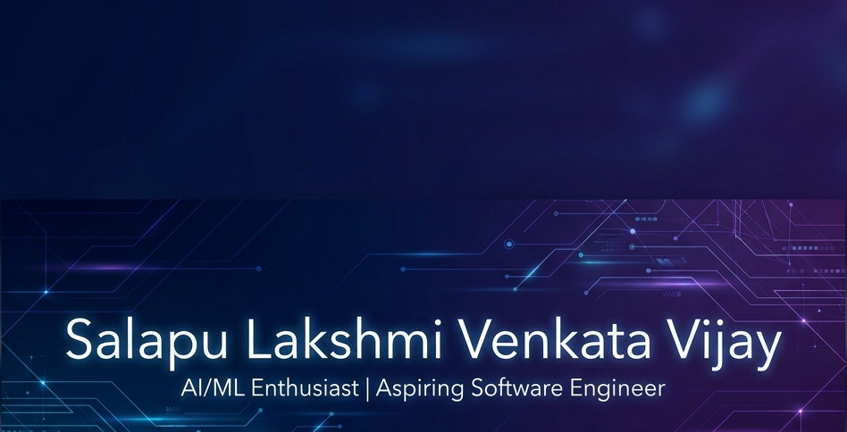

<div align="center">



<picture>
  
</picture>

<p align="center">
  <strong>🔥 B.Tech CSE Student | AI/ML Enthusiast | Data Analyst & NLP Specialist 🔥</strong>
</p>


<!-- Vibrant, Colorful Top Badges Spectrum -->
[](https://github.com/SalapuVijay)
[](https://github.com/SalapuVijay)
[](https://www.linkedin.com/in/slvvijay03/)
[](https://github.com/SalapuVijay?tab=repositories)
[](https://github.com/SalapuVijay)
[](https://github.com/SalapuVijay)

</div>

---

## 🚀 About Me


```python
class SalapuVijay:
    def __init__(self):
        self.name = "Salapu Lakshmi Venkata Vijay"
        self.role = "B.Tech Computer Science Student, AI/ML Enthusiast & Data Analyst"
        self.location = "India 🇮🇳"
        self.languages = ["Python", "C++", "C", "Java", "SQL"]
        self.interests = ["AI/ML", "NLP", "Data Analytics", "SDE"]
    
    def current_work(self):
        return {
            "🎯 focus": "Building NLP & AI-Integrated projects using Python",
            "📚 learning": "Deep Learning, System Design & MLOps",
            "🤝 collaborating": "AI/ML Open Source & Python Development"
        }
    
    def get_daily_routine(self):
        return "📊 Analyze → 🤖 Model → 📈 Deploy → 🔄 Repeat"
```

<br clear="right"/>

---

## 🔥 Current Focus

 Building **AI/ML projects using Python**

 Learning **Data Structures and Algorithms**

 Developing **NLP-based applications & AutoCorrect AI**

 Improving **problem-solving and software development skills**

---

## 🛠️ Tech Stack

<div align="center">

### 👨‍💻 Programming Languages


### 🤖 AI, Machine Learning & NLP


### 🌐 Web Development & Databases


### 📈 Data Visualization & BI Tools


### ⚙️ Tools & Technologies


</div>


---

## 📊 Performance Metrics

<div align="center">

<p align="center">
  
</p>

</div>

---

## 🏆 LeetCode Stats

<div align="center">

[](https://leetcode.com/u/2EylzqhYHH/)

</div>

---

## 📈 Contribution Heatmap & Activity Graph

<div align="center">


[](https://github.com/SalapuVijay)

</div>

---

## 🌐 Connect With Me

<div align="center">

<a href="https://www.linkedin.com/in/slvvijay03/">
  
</a>
<a href="https://instagram.com/s.l.v_vijay">
  
</a>
<a href="https://github.com/SalapuVijay">
  
</a>
<a href="mailto:salapuvijay.visit2006@gmail.com">
  
</a>

<br><br>


### 💡 Dev Quote of the Day


</div>

---

<div align="center">

### 🗣️ "In God we trust. All others must bring data." - W. Edwards Deming


**🌐 From [SalapuVijay](https://github.com/SalapuVijay) | Building Intelligent Systems 🚀**


</div>
